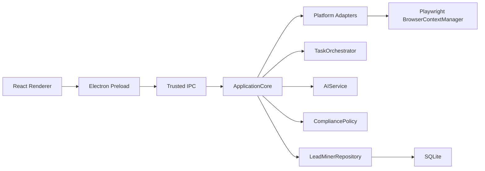

# CLAUDE.md

This file provides guidance to Claude Code when working with this repository.

## 项目概述

客户线索挖掘平台是一个 Windows 桌面优先应用，用 Electron + React + TypeScript + Playwright + SQLite 构建。当前维护主线是 TypeScript/Electron 桌面工作台；仓库中仍保留 Python/PyQt6 代码作为历史兼容层和回归参考，除非明确处理兼容问题，不再以 Python 版本作为产品主线。

## GitHub 与版本规则

- 远程维护目标是 GitHub：`https://github.com/hugocat26-jpg/ANI_SHOW.git`。
- 不再向 Gitee 同步。
- 每次提交都必须更新软件版本号。
- 推荐版本更新命令：`npm version patch --no-git-tag-version`。
- pre-commit hook 会要求 `package.json` 与 `package-lock.json` 同步更新且版本一致。
- 本地启用 hook：`npm run hooks:install`。

## 常用命令

```bash
npm run hooks:install
npm run check:types
npm test
npm run build
npm audit --omit=dev
npm run package
```

Python 兼容层验证：

```bash
py -3 -m compileall -q core storage network tests
py -3 -m unittest discover -s tests
```

## 当前核心架构



## 关键模块

- `apps/desktop/src/main/index.ts`：Electron 主进程、可信 IPC、系统对话框、通知和安全边界。
- `apps/desktop/src/preload/index.ts`：Renderer 可访问 API 白名单。
- `apps/desktop/src/renderer/src/App.tsx`：桌面工作台 UI。
- `packages/core/src/application/application-core.ts`：搜索、采集、导入、AI、导出、审计和隐私清理的业务入口。
- `packages/core/src/platform/`：平台 Adapter、能力策略、评论解析和官方 API 接入。
- `packages/core/src/data/repository.ts`：SQLite 持久化、审计日志、任务、线索、配置和密钥备份。
- `scripts/pre-commit.mjs`：提交前质量门禁和版本号强制检查。

## 维护原则

- 新功能优先落在 TypeScript/Electron 主线。
- Python/PyQt6 文件只作为兼容层维护；避免把新产品能力继续扩展到旧 UI。
- 任何涉及平台账号、登录态、评论采集、导出、密钥、URL 请求和 IPC 的改动都要优先考虑合规、安全和审计。
- 发布前至少执行 `npm run check:types`、`npm test`、`npm run build`、`npm audit --omit=dev`。
