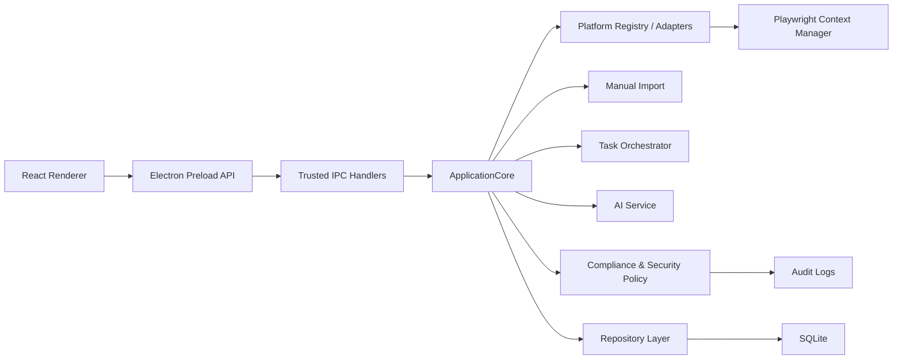

# 客户线索挖掘平台架构计划

## 当前结论

项目已全面转入 Electron + React + TypeScript + Playwright + SQLite 主线维护。Python/PyQt6 代码保留为历史兼容层、旧数据/旧逻辑参考和回归测试对象，不再作为新功能主线。

远程维护目标是 GitHub：`https://github.com/hugocat26-jpg/ANI_SHOW.git`。后续不再同步 Gitee。

## 目标

- 多平台公开内容搜索与内容解析。
- 平台登录态管理与账号风险保护。
- 评论、手动导入和官方 API 数据入口统一入库。
- AI 关键词扩展、线索评分、摘要、恢复建议和成本统计。
- 本地优先的数据安全、密钥保护、导出脱敏、隐私清理和审计日志。
- Windows 桌面打包发布，后续保留团队协作扩展空间。

## 架构

## 模块边界

### Desktop Shell

Electron 主进程负责窗口、安全导航、可信 IPC、系统保存对话框、系统通知、版本读取和打包运行时配置。Renderer 不能直接访问 Node 能力。

### Renderer

React 工作台负责搜索工作台、平台中心、搜索结果、任务中心、线索中心、AI 分析、审计日志和设置页。UI 只调用 preload 暴露的业务 API。

### Application Core

`ApplicationCore` 是所有业务命令入口，负责协调平台、任务、AI、合规、隐私清理、导出和审计。UI 和 Electron IPC 不直接操作数据库或平台实现。

### Platform Layer

平台通过 Adapter 接入，统一提供状态检查、登录、搜索、内容解析和评论采集。平台能力由 manifest 和 capability policy 派生，避免新增平台时扩散硬编码清单。

### Data Layer

`LeadMinerRepository` 管理 SQLite 表、平台配置、AI Provider、搜索结果、内容、评论、线索、任务、审计日志、密钥备份和隐私清理。

### AI Layer

AI 服务统一处理关键词扩展、线索评分、评论分析、失败策略、成本估算和恢复建议。密钥优先使用系统加密或 `env:VAR_NAME` 引用。

## 版本与提交策略

- 软件版本号以 `package.json` 为准，并同步到 `package-lock.json`。
- 桌面端通过 Electron `app.getVersion()` 显示当前版本。
- 每次提交必须 bump 版本号；pre-commit hook 会强制检查。
- 推荐命令：`npm version patch --no-git-tag-version`。

## 下一步

下一步按 [DEVELOPMENT_PLAN.md](DEVELOPMENT_PLAN.md) 执行：

1. P1：官方 API 用量历史与趋势。
2. P2：工作台前端性能和信息架构。
3. P3：安全专项扫描和高风险边界。
4. P4：发布治理。
5. P5：平台扩展策略。
