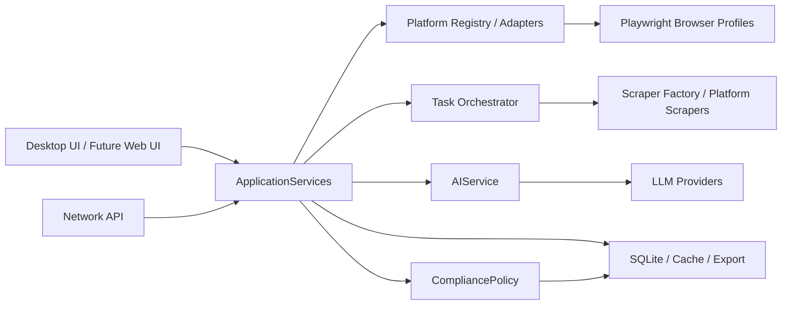

# 客户线索挖掘工具架构计划

## 目标

本项目要从单机采集工具演进为可扩展的客户线索挖掘平台，核心能力包括：

- 多平台搜索与内容解析：国内外社交平台、社区、电商内容、Google/Bing 搜索引擎。
- 登录态管理：按平台检测登录状态、引导二维码或账号登录、保存浏览器会话。
- 评论与公开内容采集：支持限速、重试、失败恢复、平台能力差异。
- AI 大模型赋能：关键词扩展、搜索重排、线索评分、摘要、去重、话术生成、风险识别。
- 合规与安全：本地优先、认证保护、导出脱敏、敏感字段过滤、使用量限制、审计日志。
- 可部署形态：桌面端优先，保留服务器模式和未来团队协作空间。

## 语言与技术选型结论

当前阶段不建议全量更换编程语言。

Python 仍适合作为核心主干：

- Playwright、requests、SQLite、Excel 导出、AI SDK 接入生态成熟。
- 当前代码和测试已有基础，迁移成本低于重写。
- PyInstaller 可继续生成 Windows 可执行文件。
- 采集、解析、AI 编排属于 Python 擅长领域。

未来可按复杂度局部引入其他技术：

- UI 若继续变复杂，可迁移到 Tauri + React/Vue，Python 作为本地服务进程。
- 服务器协作模式若增强，可保留 Flask 或迁移 FastAPI，但当前先不引入新依赖。
- 高并发采集或任务调度若成为瓶颈，再考虑独立 worker 进程，而不是立即换语言。

建议路线：短中期坚持 Python 分层重构，长期采用“Python Core + Web UI Shell”的混合架构。

## 推荐架构

## 已落地地基

- `core/app_services.py`：统一装配应用依赖，避免 UI 直接创建底层模块。
- `core/platforms/`：平台元信息、能力、状态、错误码、注册表和扩展目录。
- `core/ai_service.py`：业务级 AI 门面，承接关键词扩展、排序、评分、话术等能力。
- `core/llm_factory.py`：统一创建 LLM provider，减少 UI 对模型厂商的耦合。
- `core/policies.py`：合规策略层，后续采集、导出、服务器接口都可复用。

## 模块边界

### UI 层

负责展示、交互、状态反馈，不直接实现平台搜索、AI 判断、数据库写入规则。

### ApplicationServices 层

负责应用依赖装配，是桌面端、服务器模式、测试、未来自动任务共同使用的入口。

### Platform 层

每个平台都通过 Adapter 接入，统一暴露：

- `check_status`
- `login`
- `search`
- `scrape comments`
- `capabilities`
- `error_code`

这样接入 Google、TikTok、微博、知乎时，不需要继续扩大 `searcher.py`。

### AI 层

统一提供业务能力，不让 UI 和任务管理器直接调用各厂商模型：

- 搜索词扩展
- 搜索结果重排
- 标题与摘要修复
- 评论意向识别增强
- 线索评分
- 批量摘要
- 跟进话术
- 重复线索合并建议

### Policy 层

统一处理安全与合规：

- 平台采集边界
- 导出字段过滤
- 私密字段拦截
- 日使用量限制
- 服务器接口认证策略
- 审计日志策略

### Task 层

负责队列、并发、暂停、恢复、失败保存、重试和平台限速。UI 只订阅任务状态。

## 迭代计划

### 第一阶段：稳固现有功能

- 保留 Python/PyQt6。
- 将 `searcher.py` 中平台状态、登录、搜索逐步迁移到平台 Adapter。
- 将主窗口中剩余业务逻辑继续下沉到服务层。
- 保持现有回归测试全绿。

### 第二阶段：多平台扩展

- 优先完善 Google 搜索引擎入口。
- 新增 TikTok、微博、知乎、Reddit、X/Twitter、快手平台 Adapter。
- 为每个平台配置登录要求、限速、能力开关和失败错误码。

### 第三阶段：AI 深度赋能

- 搜索前 AI 生成关键词矩阵。
- 搜索后 AI 重排与去重。
- 评论采集后 AI 评分、聚类、摘要。
- 支持批量生成跟进话术和客户标签。

### 第四阶段：产品化与团队协作

- 若 UI 复杂度明显上升，评估迁移 Tauri + React/Vue。
- Python Core 保持为本地服务进程。
- 增加任务历史、审计日志、权限控制、团队同步。

## 暂不建议全量重写的原因

- 当前核心风险来自模块边界不清，而不是 Python 语言本身。
- 全量换语言会同时打断采集、登录态、打包、测试、数据库、AI 接入。
- 多平台自动化依赖浏览器行为，Python Playwright 仍然足够强。
- 先重构边界，再按模块替换，比一次性重写更安全。

## 决策

当前采用 Python 分层架构继续演进。

后续只有在以下条件同时出现时，才启动 UI 技术迁移：

- UI 状态复杂到 PyQt 维护成本明显高于 Web 技术。
- 需要更强的页面级组件化、图表、工作台式交互。
- 核心服务层已经稳定，能够作为本地 API 被新 UI 调用。

这意味着短期重点不是换语言，而是把平台、AI、任务、合规、安全这些增长点拆成稳定边界。
