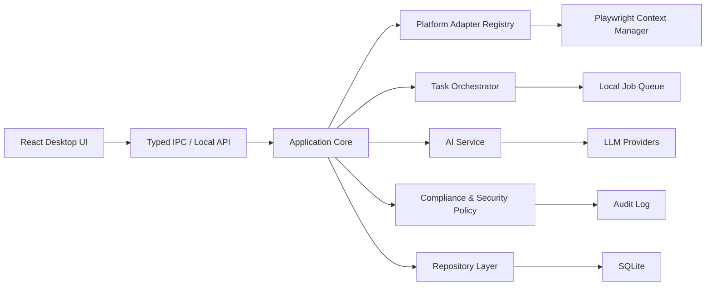

# 客户线索挖掘平台 Greenfield 架构蓝图

## 定位

这是一个面向“公开内容线索发现”的桌面优先平台，核心目标不是单个平台爬虫，而是一套可扩展的工作台：

- 在国内外主流平台和搜索引擎中发现潜在线索。
- 管理平台登录状态、搜索任务、采集任务和失败恢复。
- 用 AI 大模型完成关键词扩展、内容理解、线索评分、摘要、去重和跟进建议。
- 内置合规、安全、数据脱敏和审计能力。
- 支持从个人桌面工具逐步演进到团队协作版本。

## 推荐技术栈

如果不考虑当前代码包袱，推荐采用：

- 桌面壳：Electron
- 前端：React + TypeScript
- 后端运行时：Node.js + TypeScript
- 浏览器自动化：Playwright
- 本地数据库：SQLite
- ORM/查询层：Drizzle ORM 或 Kysely
- 后台任务：BullMQ 风格的本地任务队列，单机版可先自研轻量队列
- AI Provider 层：统一 LLM Adapter
- 打包：Electron Builder
- 测试：Vitest + Playwright Test

## 为什么不是纯 Python

Python 很适合采集和 AI，但如果这是刚开始的新项目，长期产品化会遇到几个问题：

- PyQt UI 复杂后维护成本高，状态管理和组件化弱于 React。
- 平台登录状态、任务监控、实时状态面板、AI 工作台更适合 Web UI。
- Electron 与 Chromium、Node Playwright、桌面打包的生态配合更自然。
- TypeScript 可以统一前端、后端、平台 Adapter、API DTO 的类型。

Python 可以作为后续可选 sidecar，用于：

- 本地 ML/Embedding
- 文档解析
- 特殊数据处理
- 需要 Python 生态的模型或算法

但主架构建议用 TypeScript 统一。

## 总体架构



## 分层设计

### 1. UI Layer

职责：

- 搜索工作台
- 平台登录状态面板
- 任务队列与进度展示
- 线索表格、筛选、标注、导出
- AI 分析结果、评分、摘要、跟进建议
- 设置、安全、合规提示

技术建议：

- React
- TanStack Query
- Zustand
- TanStack Table
- Radix UI 或 shadcn/ui 风格组件

### 2. Application Core

职责：

- 编排搜索、采集、AI、导出、合规校验。
- 向 UI 暴露稳定的业务命令。
- 不直接依赖具体平台实现。

核心命令：

- `searchAcrossPlatforms`
- `checkPlatformStatuses`
- `loginPlatform`
- `createCollectionTask`
- `pauseTask`
- `resumeTask`
- `stopTask`
- `analyzeLeads`
- `exportLeads`

### 3. Platform Adapter Layer

每个平台都是独立 Adapter。

统一接口：

```ts
interface PlatformAdapter {
  spec: PlatformSpec
  checkStatus(): Promise<PlatformStatus>
  login(): Promise<LoginResult>
  search(input: SearchInput): Promise<SearchResult[]>
  parseContent(url: string): Promise<ContentRef>
  collectComments(task: CollectTask): AsyncIterable<CollectEvent>
}
```

平台元信息：

```ts
interface PlatformSpec {
  key: string
  name: string
  category: 'search_engine' | 'social' | 'forum' | 'video' | 'ecommerce'
  domains: string[]
  requiresLogin: boolean
  capabilities: PlatformCapability[]
  rateLimit: RateLimitPolicy
}
```

首批平台：

- Google
- Bing
- YouTube
- TikTok
- Instagram
- Facebook
- X/Twitter
- Reddit
- 抖音
- B站
- 小红书
- 微博
- 知乎
- 快手

### 4. Browser Context Manager

职责：

- 每个平台独立持久化浏览器 Profile。
- 保存登录态。
- 检测 Cookie/localStorage/session 是否有效。
- 控制并发页面数。
- 统一注入基础反自动化兼容脚本。
- 处理验证码、二维码登录和人工接管。

关键原则：

- 登录过程必须显式由用户触发。
- 需要登录时提示用户，不静默绕过。
- 对每个平台设置限速和失败退避。

### 5. Task Orchestrator

任务类型：

- 平台状态检测任务
- 搜索任务
- 内容解析任务
- 评论采集任务
- AI 分析任务
- 导出任务

任务能力：

- 暂停、恢复、停止
- 失败重试
- 失败原因持久化
- 平台级并发限制
- 全局并发限制
- 崩溃后恢复

### 6. AI Service

AI 能力不是简单“调用大模型”，而是产品核心层。

能力规划：

- 搜索词扩展
- 多语言关键词生成
- 搜索结果重排
- 标题和摘要清洗
- 评论意向识别
- 线索评分
- 相似线索去重
- 用户画像摘要
- 批量线索总结
- 跟进话术生成
- 合规风险提醒

统一接口：

```ts
interface AIService {
  expandKeywords(input: KeywordInput): Promise<KeywordPlan>
  rankSearchResults(input: RankInput): Promise<SearchResult[]>
  scoreLead(input: LeadInput): Promise<LeadScore>
  summarizeBatch(input: LeadBatch): Promise<BatchSummary>
  generateFollowup(input: FollowupInput): Promise<FollowupSuggestion>
}
```

### 7. Compliance & Security

内置策略：

- 默认本地运行。
- 服务器/API 模式必须开启认证。
- 不采集非公开信息。
- 不导出密码、手机号、身份证、精确地址等敏感字段。
- 导出前脱敏。
- 所有批量任务记录审计日志。
- 每个平台支持独立采集限速。
- 对登录、导出、删除等敏感动作二次确认。

### 8. Data Layer

核心表：

- `platform_accounts`
- `platform_statuses`
- `search_sessions`
- `search_results`
- `collection_tasks`
- `contents`
- `comments`
- `leads`
- `lead_scores`
- `companies`
- `ai_runs`
- `exports`
- `audit_logs`

设计原则：

- 原始数据和 AI 分析结果分表。
- 任务状态必须持久化。
- 平台账号状态单独维护。
- 导出记录可追溯。
- 删除操作进入审计日志。

## 目录结构建议

```text
apps/
  desktop/
    src/
      renderer/
      main/
      preload/
packages/
  core/
    src/
      application/
      ai/
      platform/
      task/
      policy/
      domain/
  adapters/
    src/
      google/
      youtube/
      douyin/
      xiaohongshu/
      bilibili/
      tiktok/
  data/
    src/
      schema/
      repositories/
      migrations/
  shared/
    src/
      types/
      errors/
      events/
tests/
  unit/
  integration/
  e2e/
```

## 开发阶段规划

### M1：基础工作台

- Electron + React 项目骨架。
- SQLite 数据层。
- 平台注册表。
- Google/Bing/YouTube/B站最小搜索闭环。
- 平台状态面板。
- 基础任务队列。

### M2：登录态与国内平台

- 抖音、小红书、微博、知乎 Adapter。
- 二维码/账号登录引导。
- 登录状态检测。
- 持久化浏览器 Profile。
- 失败原因和重试策略。

### M3：AI 线索引擎

- AI 关键词扩展。
- 搜索结果重排。
- 评论意向识别。
- 线索评分。
- 批量摘要。
- 跟进话术。

### M4：合规、安全、导出

- 字段脱敏。
- 导出模板。
- 审计日志。
- API 认证。
- 使用量限制。
- 平台采集策略配置。

### M5：产品化

- 可视化看板。
- 多项目管理。
- 任务历史。
- 插件化平台接入。
- 团队协作模式预留。

## 最终建议

如果完全按新项目规划，推荐采用：

**Electron + React + TypeScript + Playwright + SQLite**

这是目前最适合该产品形态的主架构。它兼顾：

- 桌面应用体验
- 平台登录和浏览器自动化
- 复杂 UI 工作台
- 多平台 Adapter 扩展
- AI 能力编排
- Windows exe 打包
- 长期可维护性

Python 不必丢弃，但更适合作为可选算法 sidecar，而不是新项目的主 UI 和主编排层。
