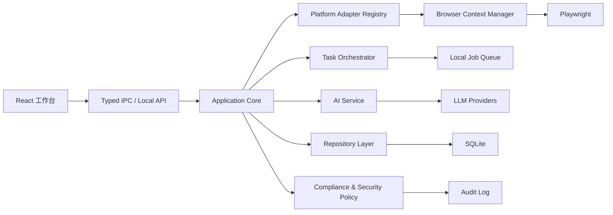
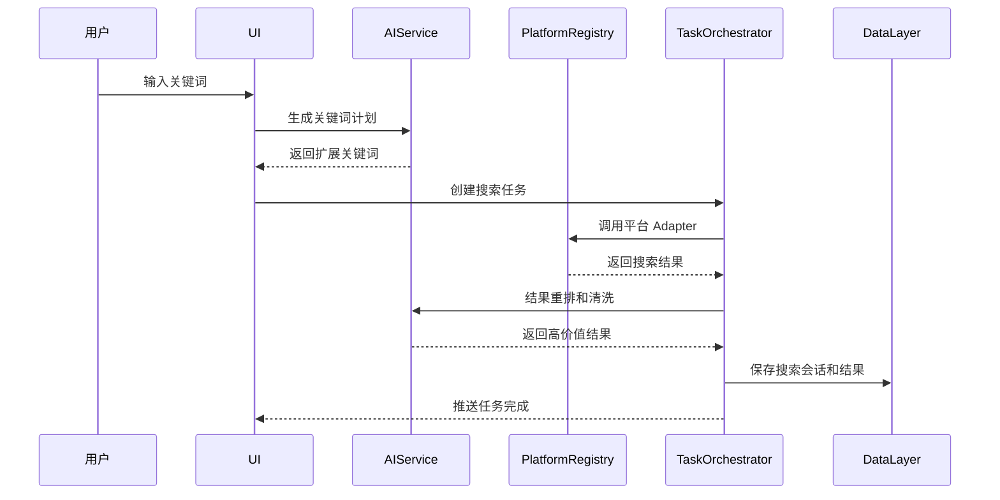
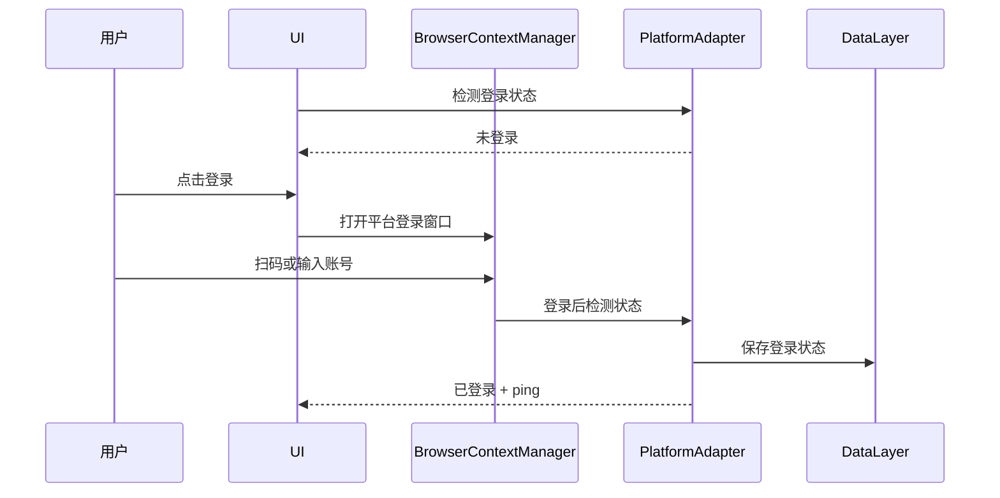
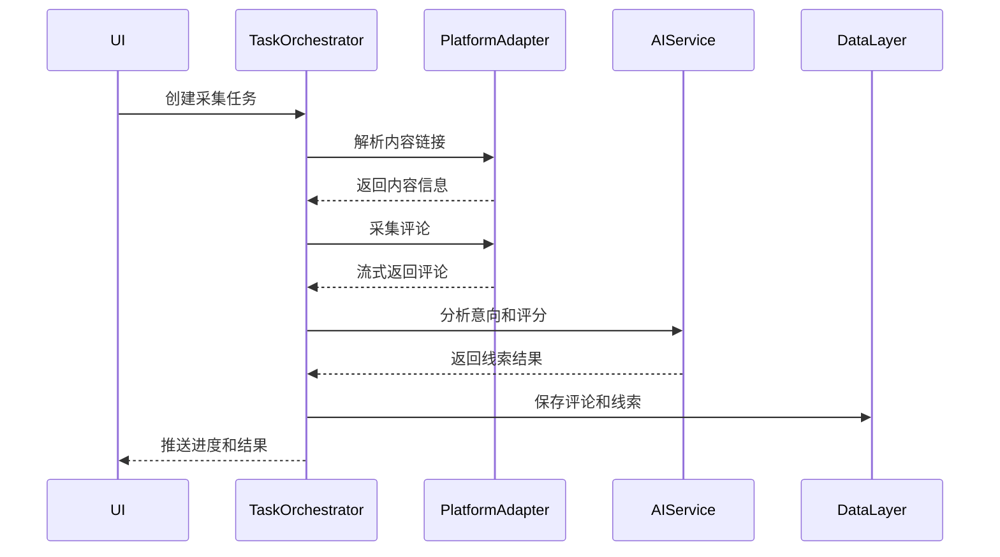

# 客户线索挖掘平台完整设计方案

## 1. 产品目标

打造一个桌面优先、可扩展、多平台、AI 驱动的客户线索挖掘平台。用户可以通过关键词在国内外主流平台和搜索引擎中发现公开内容，采集公开评论或互动信息，使用 AI 判断购买意向、生成客户画像、评分、摘要和跟进建议，并在合规边界内导出线索数据。

核心价值：

- 从多平台公开内容中发现潜在客户。
- 管理平台登录态和采集任务。
- 用 AI 降低人工筛选成本。
- 提供合规、安全、可审计的数据处理流程。
- 支持未来接入更多平台和团队协作。

## 2. 推荐技术架构

推荐新架构：

```text
Electron + React + TypeScript + Playwright + SQLite
```

技术分工：

- Electron：桌面壳、系统权限、打包、主进程任务调度。
- React：复杂工作台 UI、平台状态面板、任务队列、数据表格。
- TypeScript：统一前端、后端、平台 Adapter、数据 DTO 类型。
- Playwright：平台登录、搜索、内容解析、评论采集。
- SQLite：本地数据、任务、线索、AI 分析、审计日志。
- Drizzle ORM 或 Kysely：类型安全的数据访问。
- Vitest + Playwright Test：单元测试、集成测试、端到端测试。

## 3. 总体架构



## 4. 功能范围

### 4.1 多平台搜索

首批平台：

- 搜索引擎：Google、Bing。
- 视频平台：YouTube、TikTok、抖音、B站、快手。
- 图文/种草平台：小红书、Instagram。
- 社交平台：Facebook、X/Twitter、微博。
- 社区问答：Reddit、知乎。

搜索能力：

- 单关键词搜索。
- AI 扩展关键词搜索。
- 多平台并行搜索。
- 按平台、内容类型、时间、热度筛选。
- 搜索结果去重。
- 标题和摘要清洗。
- AI 相关性重排。
- 将搜索结果加入采集队列。

### 4.2 平台登录状态管理

每次打开软件自动检查所有平台登录状态。

每个平台显示：

- 平台名称。
- 是否可访问。
- 是否已登录。
- ping 延迟。
- 最近检测时间。
- 登录按钮。
- 异常原因，例如需要验证码、网络失败、登录失效、平台限制。

登录方式：

- 二维码登录。
- 账号密码登录页面人工输入。
- 浏览器窗口人工接管。
- 登录成功后保存独立平台 Profile。

原则：

- 不静默绕过验证码。
- 不保存用户明文密码。
- 登录动作必须由用户主动触发。
- 不同平台使用独立浏览器上下文。

### 4.3 内容解析与评论采集

支持：

- 用户手动粘贴链接。
- 从搜索结果加入链接。
- 批量链接解析。
- 平台识别。
- 内容 ID 提取。
- 评论采集。
- 评论分页/滚动加载。
- 平台限速。
- 失败重试。
- 崩溃恢复。

采集状态：

- 等待中。
- 正在解析。
- 正在采集。
- 正在 AI 分析。
- 已暂停。
- 已停止。
- 已完成。
- 已失败。

失败信息必须持久化：

- 登录失效。
- 网络错误。
- 平台限流。
- 选择器失效。
- 验证码阻断。
- 内容不存在。
- 评论关闭。

### 4.4 AI 大模型能力

AI 是平台核心能力，不只是附加功能。

#### 搜索前

- 根据产品、行业、区域生成关键词矩阵。
- 生成多语言关键词。
- 生成平台特定搜索词，例如小红书风格、Reddit 风格、Google SEO 风格。

#### 搜索后

- 判断搜索结果相关性。
- 清洗标题和摘要。
- 合并重复内容。
- 识别内容主题。
- 标记高价值内容。

#### 评论采集后

- 购买意向识别。
- 线索评分。
- 客户痛点提取。
- 产品需求提取。
- 用户画像摘要。
- 相似评论聚类。
- 高价值线索解释。
- 跟进话术生成。

#### 数据分析

- 批量线索总结。
- 平台效果对比。
- 关键词效果对比。
- 高意向评论 Top N。
- 常见异议和痛点统计。
- 潜在市场趋势总结。

AI Provider：

- OpenAI。
- DeepSeek。
- 通义千问。
- Kimi。
- 文心。
- 后续支持本地模型。

统一接口：

```ts
interface AIService {
  expandKeywords(input: KeywordInput): Promise<KeywordPlan>
  rankSearchResults(input: RankInput): Promise<SearchResult[]>
  cleanSearchResult(input: SearchResult): Promise<SearchResult>
  analyzeIntent(input: CommentInput): Promise<IntentResult>
  scoreLead(input: LeadInput): Promise<LeadScore>
  summarizeBatch(input: LeadBatch): Promise<BatchSummary>
  generateFollowup(input: FollowupInput): Promise<FollowupSuggestion>
  detectComplianceRisk(input: DataRecord): Promise<RiskResult>
}
```

### 4.5 线索管理

线索字段：

- 平台。
- 昵称。
- 用户公开 ID。
- 评论内容。
- 评论时间。
- 来源链接。
- 内容标题。
- 意向等级。
- AI 评分。
- 需求标签。
- 痛点标签。
- 跟进建议。
- 是否已处理。
- 备注。
- 导出状态。

能力：

- 表格查看。
- 多条件筛选。
- 去重。
- 手动标记。
- 批量修改状态。
- 批量 AI 分析。
- 导出 CSV/XLSX。
- 导出字段选择。
- 导出前脱敏。

### 4.6 公司与商业信息挖掘

用于 B2B 场景：

- 从网页、简介、公开资料中提取公司名。
- 提取官网、邮箱、电话等公开商务联系方式。
- 公司去重。
- 关联平台账号。
- 关联线索。
- AI 生成公司摘要。
- 风险提示和信息来源追踪。

注意：涉及个人隐私字段必须默认过滤或脱敏。

### 4.7 安全与合规

默认策略：

- 本地优先。
- 服务器模式必须开启认证。
- API 默认监听 `127.0.0.1`。
- 禁止默认开放写接口。
- 导出前敏感字段过滤。
- 日使用量限制。
- 平台级限速。
- 审计日志。

敏感动作：

- 登录。
- 删除数据。
- 导出数据。
- 切换服务器模式。
- 启用远程访问。

这些动作需要确认或记录审计。

合规策略：

- 只处理公开可访问信息。
- 不破解平台限制。
- 不绕过验证码。
- 不采集密码、身份证、银行卡、精确住址等敏感字段。
- 用户需要确认合规声明。
- 导出文件记录导出时间、字段、数量。

## 5. 核心模块设计

### 5.1 Platform Adapter Registry

每个平台独立实现，不污染核心业务。

```ts
interface PlatformAdapter {
  spec: PlatformSpec
  checkStatus(): Promise<PlatformStatus>
  login(): Promise<LoginResult>
  search(input: SearchInput): Promise<SearchResult[]>
  parseContent(url: string): Promise<ContentRef>
  collectComments(input: CollectInput): AsyncIterable<CollectEvent>
}
```

平台能力：

- `search`
- `login`
- `status`
- `parse_content`
- `collect_comments`
- `collect_author`
- `search_by_hashtag`
- `search_by_site`

统一错误码：

- `OK`
- `LOGIN_REQUIRED`
- `CAPTCHA_REQUIRED`
- `RATE_LIMITED`
- `NETWORK_ERROR`
- `SELECTOR_CHANGED`
- `NO_RESULTS`
- `CONTENT_NOT_FOUND`
- `PERMISSION_DENIED`
- `UNSUPPORTED`

### 5.2 Browser Context Manager

职责：

- 创建平台独立浏览器上下文。
- 管理持久化 Profile。
- 检测 Cookie、localStorage、sessionStorage。
- 控制页面数量。
- 自动关闭闲置页面。
- 提供人工登录窗口。
- 记录登录状态。

Profile 设计：

```text
userData/
  profiles/
    douyin/
    xiaohongshu/
    youtube/
    google/
    tiktok/
```

### 5.3 Task Orchestrator

任务结构：

```ts
interface Task {
  id: string
  type: TaskType
  status: TaskStatus
  platformKey?: string
  input: unknown
  progress: number
  errorCode?: string
  errorMessage?: string
  createdAt: string
  updatedAt: string
}
```

任务类型：

- `check_platform_status`
- `login_platform`
- `search`
- `parse_content`
- `collect_comments`
- `analyze_leads`
- `export`

任务要求：

- 所有终态持久化。
- 支持暂停、恢复、停止。
- 支持平台级并发。
- 支持全局并发。
- 支持失败重试和退避。
- UI 通过事件订阅任务进度。

### 5.4 Data Layer

核心表：

```text
platforms
platform_accounts
platform_statuses
search_sessions
search_results
contents
collection_tasks
comments
leads
lead_scores
companies
ai_runs
exports
audit_logs
settings
```

设计原则：

- 原始数据、AI 结果、人工标注分离。
- 任务状态可恢复。
- 导出行为可追溯。
- 平台登录状态独立保存。
- 公司名称唯一约束。
- 搜索结果 URL 唯一约束。

### 5.5 Local API / IPC

Renderer 不直接访问数据库和文件系统，通过 Typed IPC 调用主进程。

命令：

- `platform.checkAll`
- `platform.login`
- `search.run`
- `search.cancel`
- `task.list`
- `task.pause`
- `task.resume`
- `task.stop`
- `lead.list`
- `lead.analyze`
- `lead.export`
- `settings.get`
- `settings.update`

事件：

- `platform.statusChanged`
- `task.progress`
- `task.completed`
- `task.failed`
- `lead.created`
- `audit.created`

## 6. UI 工作台设计

### 6.1 首页 / 搜索工作台

布局：

- 顶部：关键词输入、AI 扩展按钮、搜索按钮。
- 左侧：平台选择、内容类型、时间范围、登录状态。
- 中间：搜索结果表格。
- 右侧：AI 关键词计划、结果摘要、推荐采集对象。

### 6.2 平台中心

展示：

- 所有平台卡片。
- 登录状态。
- ping 延迟。
- 最近检测时间。
- 支持能力。
- 登录/重新登录按钮。
- 异常原因。

颜色：

- 绿色：已登录且可搜索。
- 黄色：可访问但未登录或能力受限。
- 红色：不可访问或登录失效。
- 灰色：未配置或暂不支持。

### 6.3 任务中心

展示：

- 当前任务。
- 排队任务。
- 历史任务。
- 失败任务。
- 任务日志。
- 重试/暂停/停止按钮。

### 6.4 线索中心

展示：

- 线索表格。
- AI 评分。
- 意向等级。
- 来源平台。
- 标签。
- 跟进状态。
- 批量操作。

### 6.5 AI 分析中心

展示：

- 批量摘要。
- 高意向线索。
- 常见需求。
- 常见异议。
- 平台表现。
- 推荐下一步关键词。

### 6.6 设置中心

包含：

- 平台设置。
- AI Provider 设置。
- 安全设置。
- 导出设置。
- 合规设置。
- 数据备份。

## 7. 关键业务流程

### 7.1 搜索流程



### 7.2 登录流程



### 7.3 采集流程



## 8. 测试方案

### 单元测试

- 平台 URL 识别。
- 平台 Adapter 注册。
- 登录状态判断。
- AI fallback。
- 线索评分。
- 合规字段过滤。
- 导出字段过滤。
- 任务状态迁移。

### 集成测试

- 搜索任务完整流程。
- 登录状态保存。
- 采集任务失败恢复。
- AI 分析结果保存。
- 导出记录审计。

### E2E 测试

- 打开应用。
- 检查平台状态。
- 执行搜索。
- 加入采集队列。
- 导出线索。

## 9. 迭代路线

### Phase 1：项目骨架

- Electron + React + TypeScript 初始化。
- SQLite 数据层。
- IPC 通道。
- 平台注册表。
- 基础 UI 框架。

### Phase 2：搜索闭环

- Google、Bing、YouTube、B站搜索。
- 搜索结果保存。
- AI 关键词扩展。
- AI 结果重排。

### Phase 3：登录态与平台中心

- 平台状态检测。
- 登录窗口。
- Profile 持久化。
- ping 显示。
- 平台能力展示。

### Phase 4：采集与线索

- 内容解析。
- 评论采集。
- 任务队列。
- 线索表格。
- 失败恢复。

### Phase 5：AI 线索引擎

- 意向识别。
- 评分。
- 摘要。
- 跟进话术。
- 批量分析。

### Phase 6：安全合规与导出

- 认证。
- 脱敏。
- 审计。
- 导出模板。
- 数据备份。

### Phase 7：扩展平台

- 抖音。
- 小红书。
- TikTok。
- Instagram。
- Facebook。
- X/Twitter。
- Reddit。
- 微博。
- 知乎。
- 快手。

## 10. 最小可行版本

MVP 必须包含：

- Electron 桌面应用。
- 平台状态面板。
- Google/Bing/YouTube/B站搜索。
- AI 关键词扩展和结果重排。
- 搜索结果加入采集队列。
- 至少一个平台评论采集闭环。
- 线索表格。
- CSV/XLSX 导出。
- 本地 SQLite。
- 基础合规提示。

## 11. 成功标准

技术成功：

- 新平台接入不修改核心业务流程。
- UI 不直接访问数据库和浏览器。
- 任务状态可恢复。
- AI Provider 可切换。
- 导出字段可控且脱敏。

产品成功：

- 用户能从关键词到线索导出完成闭环。
- 平台登录状态清晰可见。
- 高意向线索能被 AI 优先识别。
- 失败原因能被用户理解并处理。
- 新平台可持续接入。
